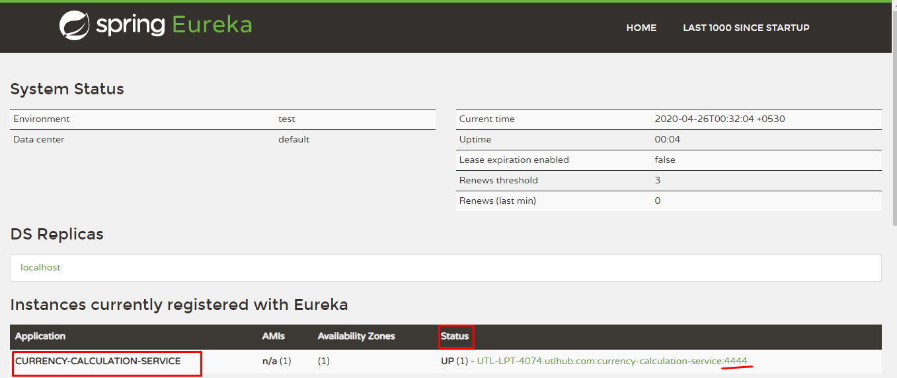

# CURRENCY-CALCULATION-SERVICE

**Currency-calculation-service** is created to calculate the total value of currency conversion if multiple number of currency converted into another currency. Main purpose to create this application is to implement **Feign Client** and **Client side load balancing with Ribbon**. Let's see step by step.

### Added Dependencies

* Spring Web
* Spring Boot DevTools
* openfeign - Feign Client
* Netflix Eureka Client

### Application.yml

Mention the application name as *currency-calculation-service* and run it on port *4444*

	spring:
	  application:
	    name: currency-calculation-service
	    
	server:
	  port: 4444
	  
### Creating an API 

Created a CurrencyConverion Controller to use RestTemplate and Feign client. implemented a api to fetch the value of multiple currency at the time of exchange it. Api is given below : 

	http://localhost:4444/api/currency-calculation-service/from/USD/to/INR/quality/10
 
There is already created [currency-exchange-service](https://github.com/vikashvs36/microservices-tutorial/tree/master/currency-exchange-service) to fetch the conversion value of 1 currency as compare to two currency. So We have A API *http://localhost:2222/api/currency-exchange-service/from/USD/to/INR* to apply the same. But we have a problem and that is, This given API is build on another service so main problem is call to API from one service to another. In such case, Two way to handle this issue which is given below, we will see it one by one :

* RestTemplate 
* Feign Client
    
### RestTemplate client

RestTemplate is way to call an API of another services. RestTemplate is present in *org.springframework.web.client.RestTemplate*. this way use in most of the spring or spring-boot application. We can use it for all method type like *Get, Post, Put, Delete* and so on.

	Map<String, String> responseType = new HashMap<>();
	responseType.put("from", from);
	responseType.put("to", to);

	String url = "http://localhost:2222/api/currency-exchange-service/from/{from}/to/{to}";
	ResponseEntity<ExchangeValue> forEntity = new RestTemplate().getForEntity(url, ExchangeValue.class, responseType);
	ExchangeValue obj = forEntity.getBody();
	
**ExchangeValue** is a response dto to contain Object which response is get from their API.

This way, we can call API's but this approach takes more time and affords of developer to implement this and using this way URL needs to do hard coded. So overcome this issue we need to implement the feign Client.

### Feign client

feign client is used to talk with the external service to call API. Feign provides a very easy way to call RESTful services. It can integrates with Ribbon and Eureka Automatically. we can use Eureka Client ID instead of the URL. So URL not needs to do hard coded.

Let's see how to implement Feign Client step by step in the application, is given below :

**1st Step :** Add Dependency

	<dependency>
		<groupId>org.springframework.cloud</groupId>
		<artifactId>spring-cloud-starter-openfeign</artifactId>
	</dependency>

**2nd Step :** Enable Feign client into the main class.

	@SpringBootApplication
	@EnableFeignClients("com.microservice.currencyexchangeservice")
	public class CurrencyExchangeServiceApplication {
		public static void main(String[] args) {
			SpringApplication.run(CurrencyExchangeServiceApplication.class, args);
		}
	}

The same class package needs to be scan where we enable feign Client

**3rd Step :**

It Needs to Create a proxy class(interface) to define all external service API's. Enable feign Client annotation ex: @FeignClient. 

	@FeignClient(name = "currency-exchange-service", url = "http://localhost:2222/")
	public interface CurrencyExchangeServiceProxy {
		
		@GetMapping(value = "/api/currency-exchange-service/from/{from}/to/{to}")
		public ExchangeValue retriveExchangeValue(@PathVariable String from, 
								@PathVariable String to);
	}

In this @FeignClient annotation there has two properties one is name and second one is url. so here we are using name to specify which service needs to call and URL is specify for port that is the caller service are running which port. If there is not included **spring-cloud-starter-netflix-ribbon** dependency, we must put the URL.  

After these configuration we are able to talk with another microService with this API which is given below :

	// Using RestTemplate Client
	http://localhost:4444/api/currency-calculation-service/from/USD/to/INR/quality/100
	
	// Using Feign Client
	http://localhost:4444/api/currency-calculation-service/feign/from/USD/to/INR/quality/100

**Note :** there is a problem to specify URL because suppose there may be *currency-exchange-service* which we want to call the API, that service have many instance so it have many port so how can we specify here URL. To overcome this issue we are going to learn **Ribbon**.

### Client Side Load Balancer : Ribbon

Ribbon is a client-side load balancer that gives you a lot of control over the behavior of HTTP and TCP clients. Feign already uses Ribbon, so, if you use @FeignClient, this section also applies.

To include Ribbon in out project, We are going step by step : 

**1st step : Add Dependency**
 
	<dependency>
		<groupId>org.springframework.cloud</groupId>
		<artifactId>spring-cloud-starter-netflix-ribbon</artifactId>
	</dependency>

**2nd step :**

> **How to Use Ribbon Without Eureka**

Actually I am not using Eureka server, it will see in next service so we are using here Ribbon with Eureka. However, if you prefer not to use Eureka, Ribbon and Feign also work. 

you have to declared a **@RibbonClient** next to @FeignClient annotation. RibbonClient annotation needs to mention name which is declared in application name whose service we want to use as given below :

	@FeignClient(name = "currency-exchange-service")
	@RibbonClient(name = "currency-exchange-service")
	public interface CurrencyExchangeServiceProxy {
		
		@GetMapping(value = "/api/currency-exchange-service/from/{from}/to/{to}")
		public ExchangeValue retriveExchangeValue(@PathVariable String from, @PathVariable String to);
	
	} 

You can see here, After mention RibbonClent annotation no need to put the Url in FeignClent annotation. So instead of mention only one Url, we can declare configured server list that means many instance of *currency-exchange-service*. 

**3rd Step :**

The Ribbon client defaults to a configured server list. You can supply the configuration in **application.yml** as follows:

	currency-exchange-service:
	  ribbon:
	    listOfServers: http://localhost:2222, http://localhost:3333
	    # you can mention here any number of servers.
	    
This code will mention in which service where we want to configure it. We can create multiple proxy service configure in *currency-calculation-service*. 

As of now, *currency-exchange-service* has two instances which is running on port *http://localhost:2222, http://localhost:3333*. Suppose this service has a lots of loads so you want to create a three, four, five or so many instances, so you can create and have to mention all these ports where you should have to call from service. But this is not the right way. because service will increase or decrease the instance as per service load. In such case, we are not able to mention listOfServers. So to overcome this problem, **Eureka Naming Server** comes in picture.

Seting up step by step the *Eureka Naming Server* is [here](https://github.com/vikashvs36/microservices-tutorial/tree/master/eureka-naming-server).

### Connecting Currency-calculation-service with the Eureka Naming Server

Lets connect this Currency-calculation-service with the Eureka Naming Server. We will go step by step as given below :

**Step 1 : Add Dependency**

Adding dependency spring-cloud-starter-netflix-eureka-client in pom.xml to do register with the *Eureka Naming Server*.  

	<dependency>
		<groupId>org.springframework.cloud</groupId>
		<artifactId>spring-cloud-starter-netflix-eureka-client</artifactId>
	</dependency>
	
**Step 2 : Add Annotation - @EnableDiscoveryClient**

To enable as discovery client added the annotation in the main class.

	@SpringBootApplication
	@EnableFeignClients("com.microservice.currencycalculationservice")
	@EnableDiscoveryClient
	public class CurrencyCalculationServiceApplication {
	
		public static void main(String[] args) {
			SpringApplication.run(CurrencyCalculationServiceApplication.class, args);
		}
	}	

Once you enable the discovery client, you need to configure the url for eureka.

**Step 3 : Configure the URL for Eureka **

To configure the URL for Eureka add the *eureka.client.service-url.defaultZone* in application.yml file.

	eureka:
	  client:
	    service-url:
	      defaultZone: http://localhost:8761/eureka/
	     
After configure the URL, run the Currency-calculation-service after Eureka naming server run and refresh the URL http://localhost:8761.  

You can see given above picture Application name is there whose services are registered and port are also there. So easily you can find here which service is running on which port. 