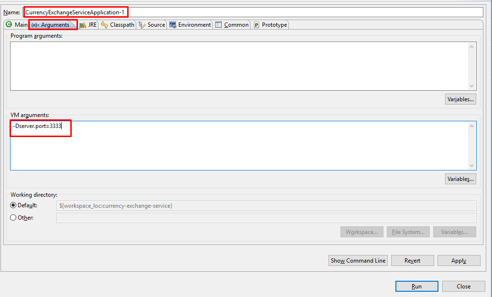

# CURRENCY EXCHANGE SERVICE

*Currency-exchange-service* is a simple microService to implement conversion the value of money from one currency to another currency. We are here using the features of microServices, is **Spring Cloud Config Client** to get the mySQL configuration  from **Spring Cloud Config Server** which is we already implemented in **Spring-Cloud-Config-Server** services. You can visit it from [here](https://github.com/vikashvs36/microservices-tutorial/tree/master/spring-cloud-config-server)

### > Added Dependency

* Spring Web
* Spring Boot DevTools
* Spring Data JPA
* MYSQL
* Spring Cloud Config Client
* Netflix Eureka Client

### > Application.yml

In this project I am using application.yml but you can use either application.yml or application.properties as your comfort.

	spring:
		application:
			name: currency-exchange-service
		datasource:
			url: jdbc:mysql://localhost:3306/currency_exchange_db?createDatabaseIfNotExist=true
			username: root
			password: *****
		jpa:
			hibernate:
			ddl-auto: create
			show-sql: true
	server:
		port: 2222

Mentioned here of datasource and jpa properties in applicaiton.yml. after we get it from Config Server.

### > Enable the config client into this application

To enable the config client feature in this application, please follow the below step :

**1st step : Add Dependency**

	 <dependency>
		<groupId>org.springframework.cloud</groupId>
		<artifactId>spring-cloud-starter-config</artifactId>
	</dependency>
	
**2nd step :**

Please add **bootstrap.yml** file to clone the configuration properties before reached on the **aplication.yml**. After create the bootstrap.yml file, Please add **spring.cloud.config.uri** property to fetch from Config Server and add **spring.profiles.active** property to fetch configuration from which profile.

	spring:
	  cloud:
	    config:
	      uri: http://localhost:8888
	      
	  profiles:
	    active: dev
    
**Note :** After add this file and properties, No need to Datasouce and Jpa properties in application.yml file.

### > Created a API in the controller

Created a API in the controller to fetch Currency values from one currency to another currency. The Currency domain is fetching from mySQL database.

	@RestController
	@RequestMapping(value = "/api/currency-exchange-service")
	public class CurrencyExchangeController {
		
		@Autowired
		private Environment environment; 
		
		@Autowired
		private ExchangeValueService exchangeValueService;
		
		@GetMapping(value = "/from/{from}/to/{to}")
		public ExchangeValue fetchCurrencyExchange(@PathVariable String from, @PathVariable String to) {
			ExchangeValue exchangeValue = exchangeValueService.retriveExchangeValue(from, to);
			exchangeValue.setPort(Integer.parseInt(environment.getProperty("local.server.port")));
			return exchangeValue;
		}
	}

There is a API **/api/currency-exchange-service/from/{from}/to/{to}** to fetch the value of money from one currency into another.

### > Create Another instance of Currency-exchange-service 

We can create many instance of any services to divide load balancing. So need to pay attention to create another instance of same service. 

**1st Step :**
 
Click on the **Run Configuration...** and create duplicate instance by right clicking as given below : 

Then go to *Arguments* after changing the *Name*. And write the port command in *VM arguments* as given below :  

	-Dserver.port=3333 // you can modify port as your wish.
	

Then *Apply* and *Run*. New instance is ready on port 3333. *Currency-exchange-service* application can be run on both port as given below :

	 // First instance - port : 2222
	 http://localhost:2222/api/currency-exchange-service/from/USD/to/INR
	 
	 // Second instance - port : 3333
	 http://localhost:3333/api/currency-exchange-service/from/USD/to/INR

Now, We can move one step ahead to next microService features. We are going to implement **Feign Client** and **Client side load balancing with Ribbon** in next microSevices [Currency-Calculation-Service]().

### Connecting Currency-exchange-service with the Eureka-Naming-Server

Lets connect this Currency-exchange-service with the Eureka Naming Server. We will go step by step as given below :

**Step 1 : Add Dependency**

Adding dependency spring-cloud-starter-netflix-eureka-client in pom.xml to do register with the *Eureka Naming Server*.  

	<dependency>
		<groupId>org.springframework.cloud</groupId>
		<artifactId>spring-cloud-starter-netflix-eureka-client</artifactId>
	</dependency>
	
**Step 2 : Add Annotation - @EnableDiscoveryClient**

To enable as discovery client added the annotation in the main class.

	@SpringBootApplication
	@EnableDiscoveryClient
	public class CurrencyExchangeServiceApplication {
	
		public static void main(String[] args) {
			SpringApplication.run(CurrencyExchangeServiceApplication.class, args);
		}
	}	

Once you enable the discovery client, you need to configure the url for eureka.

**Step 3 : Configure the URL for Eureka **

To configure the URL for Eureka add the *eureka.client.service-url.defaultZone* in application.yml file.

	eureka:
	  client:
	    service-url:
	      defaultZone: http://localhost:8761/eureka/
	     
After configure the URL, run the *Currency-exchange-service* after Eureka naming server run and refresh the URL http://localhost:8761.  

You can see given above picture Application name is there whose services are registered and port are also there. So easily you can find here which service and there instances are running on which port. 
