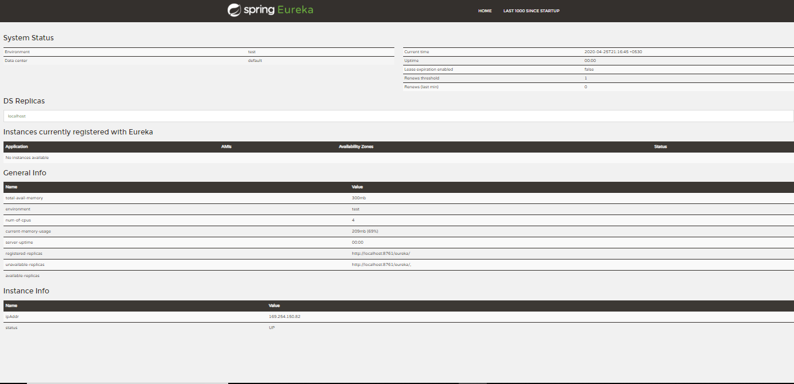

# EUREKA NAMING SERVER

Client-side service discovery allows services to find and communicate with each other without hard-coding *hostname* and *port*. There are two important feature of the Naming service

**1. Service Registeration :**

Eureka Server is using for service registration. At start of every application they would be register with the naming server. So all services and their instances which is running as *Eureka Client Service* needs to registration in Eureka server.

**2. Service Discovry :** 

Eureka Naming Server is also known as Discovery Server and whose service which are register in Eureka server is known as Discovery client.

whenever they want details of another microService they would do a service discovery , They will say I want to details of this service XYZ, can you give me the details. 

### Basic structure of this application :  

**Added Dependency** 

* Eureka Server - Required
* Config Client - Optional
* Config Client - Optional
* DevTools - Optional

Only Eureka Server is required, rest all are optional as your comfort.

**We're configuring the properties as YAML format - application.yml**

Some property keys are here as application name, server port, register-with-eureka and fetch-registry. We are familiar with application name and server port. 
	    
	spring:
	  application:
	    name: eureka-naming-server
	    
	  server:
		 port: 8761

**Note :** Port *8761* is default one for Eureka Server. you can define as your wish

### Implementing step by step a Eureka Server for service registry is as easy as :

**Step 1 :** Added Dependency
 
	<dependency>
		<groupId>org.springframework.cloud</groupId>
		<artifactId>spring-cloud-starter-netflix-eureka-server</artifactId>
	</dependency>
	
**Step 2 : ** application.yml

	eureka:
	  client:
	    register-with-eureka: false #telling the server not to register itself in the service registry
	    fetch-registry: false
	  server:
    	wait-time-in-ms-when-sync-empty: 0    #wait time for subsequent sync
	    
We are mentioned here the Eureka Client not to register with itself because our application should be acting as a server. You can let **eureka.server.wait-time-in-ms-when-sync-empty** be left.	

**Step 3 :** The main application class

	@SpringBootApplication
	@EnableEurekaServer
	public class EurekaNamingServerApplication {
	
		public static void main(String[] args) {
			SpringApplication.run(EurekaNamingServerApplication.class, args);
		}
	}
	
Now we are able to run the same service. After run we will browser to *http://localhost:8761* to view the Eureka dashboard.

> http://localhost:8761

